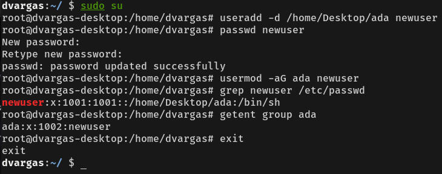
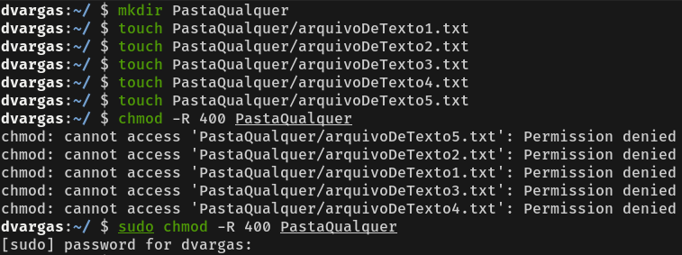
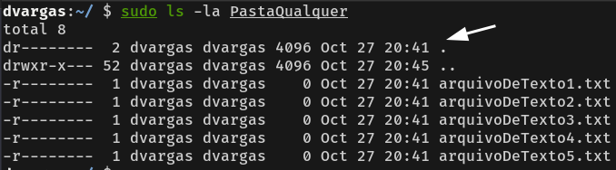
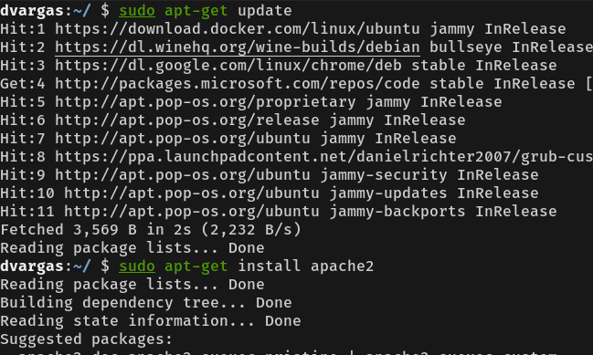
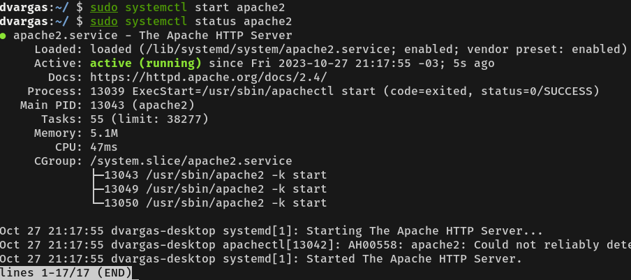
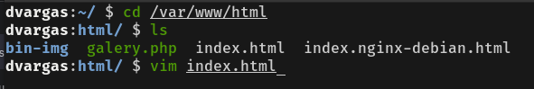
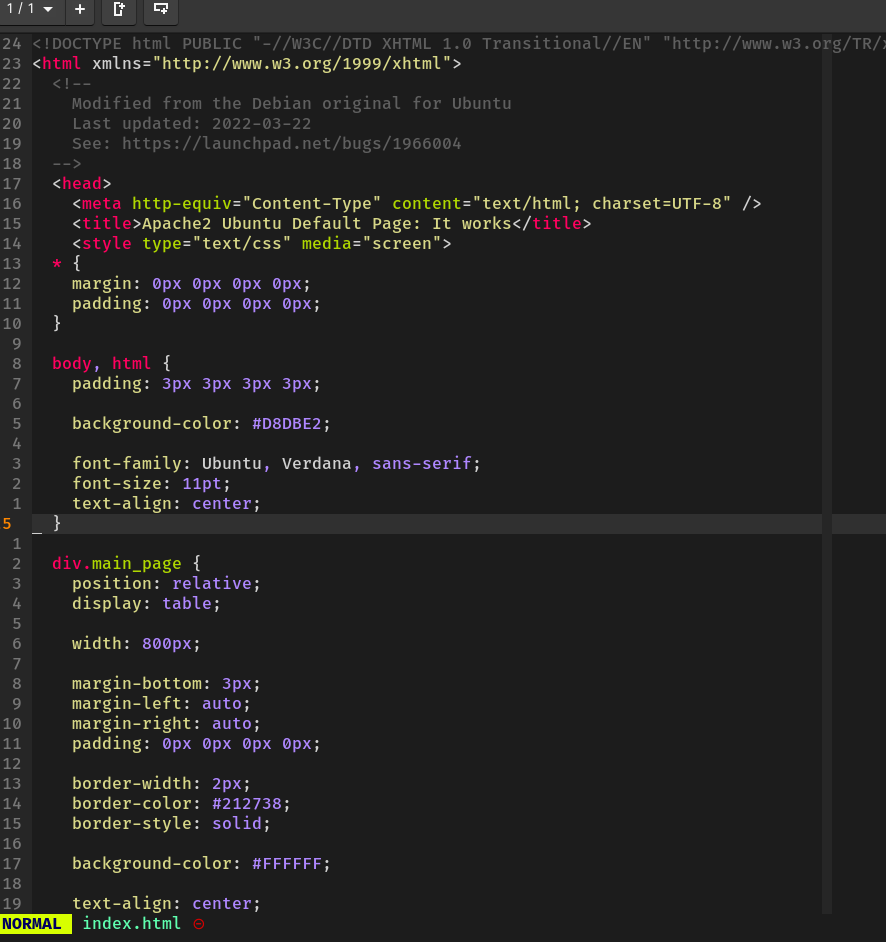
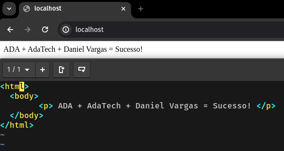

## Problema 1:

Vanessa está certíssima em criar um novo usuário para o novo membro da equipe. Dessa forma, como administradora do sistema, ela consegue controlar as permissões que esse usuário terá, incluindo a possibilidade de colocá-lo em um grupo específico e designar uma pasta raiz diretamente no terminal.

Para criar um novo usuário, Vanessa precisa de acesso ao terminal do Linux. Ela deve ser um usuário root ou pertencer ao grupo sudo para poder elevar seus privilégios para root. Vanessa pode utilizar `sudo su` e, após inserir a senha, entrar como root.

Para criar um novo usuário com uma pasta padrão, ela pode usar o comando `useradd (nome do usuário) -d (caminho da pasta)`. Também é uma prática recomendada definir uma senha para esse novo usuário usando o comando `passwd (nome do usuário)`.

Adicionalmente, é uma boa prática adicionar o novo usuário a um grupo específico para que o administrador tenha controle total. Isso pode ser feito com o comando `usermod -aG (nome do grupo) (usuário a ser adicionado)`.

Vanessa, como uma administradora responsável, quer se certificar de que o usuário foi criado e adicionado ao grupo corretamente. Ela pode usar o comando `grep (nome do usuário) /etc/passwd` para verificar a linha correspondente no arquivo `/etc/passwd`. A saída incluirá o nome de usuário, 'x' indicando que a senha está cadastrada, IDs de usuário e grupo (1001 neste caso), a pasta padrão do usuário (por exemplo, `/home/Desktop/ada`), e o shell padrão do usuario (por exemplo, `/bin/sh`).

Vanessa também pode utilizar o comando `getent group (nome do grupo)` para visualizar informações detalhadas do grupo, incluindo seu nome e os usuários que fazem parte dele.

Finalmente, após realizar as tarefas necessárias, é importante que Vanessa saia do usuário root usando o comando `exit`.

## Problema 2:

Para criar uma pasta no Linux, a gente usa o comando `mkdir (nome da pasta)`. Para criar arquivos, normalmente, usamos o comando `touch (caminho/nome do arquivo)`.

Para definir as permissões necessárias, a gente usa o comando `chmod -R (nível de permissão) (nome do arquivo)`. O `-R` garante que essas permissões se apliquem a todos os arquivos e pastas dentro do diretório especificado. É importante usar o `sudo` aqui, porque para mexer nas permissões dos arquivos, a gente precisa de privilégios altos para manter a segurança do sistema.

Para ver as permissões dos arquivos e pastas, a gente usa o comando `ls -la`. O `-l` mostra uma lista detalhada dos arquivos na pasta, incluindo as informações sobre as permissões. O `-a` mostra todos os arquivos, inclusive os arquivos ocultos que começam com um ponto (`.`).

Aqui estão alguns exemplos de permissões e o que elas significam:

`dr-------- 2 dvargas dvargas 4096 Oct 27 20:41 .` 

-   O 'd' no começo indica que é um diretório.
-   As permissões 'r--------' significam que o usuário 'dvargas' só pode ler o diretório, sem poder escrever ou executar.
-   '2' mostra que existem dois links para este diretório, incluindo os links '.' (pasta atual) e '..' (pasta pai).
-   'dvargas' (1ª ocorrência) é o dono do diretório.
-   'dvargas' (2ª ocorrência) é o grupo ao qual o diretório pertence.
-   '4096' é o tamanho do diretório em bytes.
-   'Oct 27 20:41' mostra a data e hora da última modificação do diretório.

Exemplos de arquivos com diferentes permissões:

`chmod 777 arquivo.txt` 

Todas as permissões (leitura, escrita e execução) são dadas ao dono, grupo e outros usuários, esse é um arquivo, perceba que não tem o 'd' na frente.

`chmod 070 arquivo.txt` 

Só o grupo tem permissões de leitura, escrita e execução.

É super importante entender e controlar essas permissões para manter o sistema Linux seguro, organizado e funcionando direitinho.

## Problema 3:

O professor Daniel Vieira pediu a instalação do Apache. O Apache é um servidor web que recebe requisições e entrega recursos aos clientes web. Ele é seguro e possui recursos como proxy reverso e CGI.

No meu sistema Linux baseado no Ubuntu, primeiro atualizei o gerenciador de pacotes com `sudo apt-get update` e depois usei o comando `sudo apt-get install apache2` para instalar o Apache usando o gerenciador de pacotes `apt-get`.

Para ativar o serviço do Apache, usamos o comando `systemctl start apache2` para iniciar o servidor. É crucial garantir que nenhum outro serviço esteja utilizando a mesma porta, que, por padrão, é a porta 80.

Após iniciar o serviço, podemos verificar se ele está rodando corretamente usando o comando `systemctl status apache2`.

Essa é a página padrão do Apache, ela é criada por padrão na pasta `/var/www/html`.

Como o servidor está rodando localmente ele responde no endereço `localhost:80`.

Para modificá-la podemos dar um `cd` para chegar até a pasta, um `ls` para listar os arquivos da pasta, e encontramos nela o `index.html` que é o arquivo html padrão carregado pelo apache, podemos entrar nele com um editor de arquivos, eu utilizei o `vim`.

No vim abrimos o código da página `index.html`.

Como o exercício pede, podemos apagar o conteúdo e deixar somente as tags base do html com um `
` e a frase solicitada. Já que alteramos a página padrão, quando acessarmos o endereço e porta padrão do apache, veremos a página alterada como mostra o print abaixo.

Agradeço pelos conhecimentos passados e as possibilidades do treinamento. Muito obrigado.

----------
